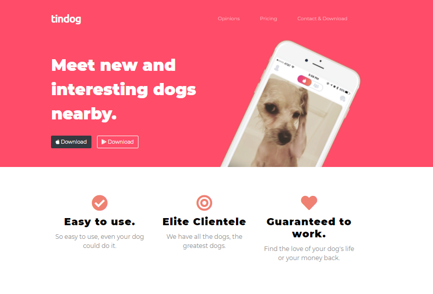
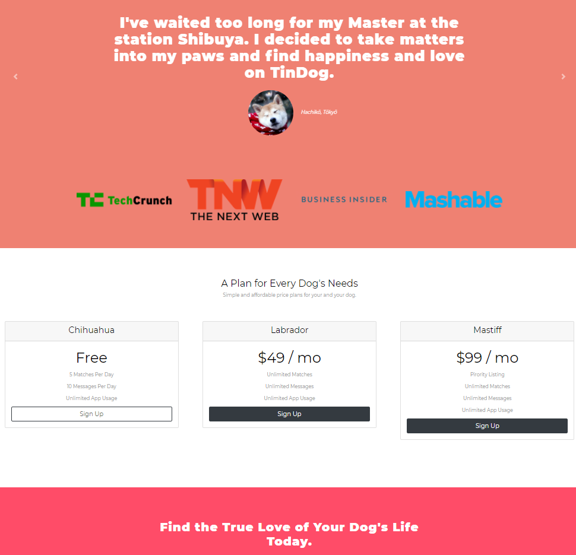

# TinDog

***

## Table of contents

* [General info](#general-info)
* [Screenshots](#screenshots)
* [Technologies](#technologies)
* [Inspiration](#inspiration)

## _General info_

TingDog RWD website - version of the tinder for dogs, for example from shelters. I wrote this page using HTML5, CSS3 and Bootstrap - components like Carousel, Navbar with toggler, Card, Grid system etc. Additionally, Google fonts and Font Awesome were used. 

## _Screenshots_

## _Technologies_
* Bootstrap - version 4.6.0

## _Inspiration_

 Project inspired by [Angela Yu](https://www.appbrewery.co)
